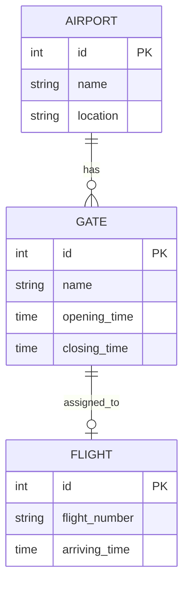
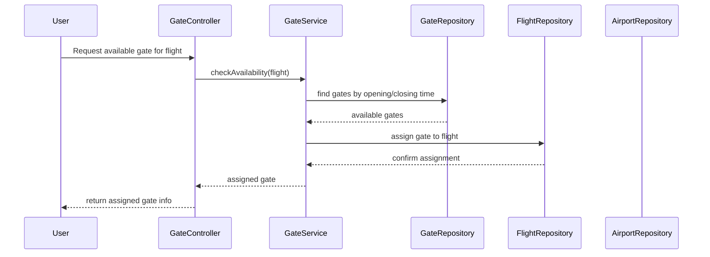
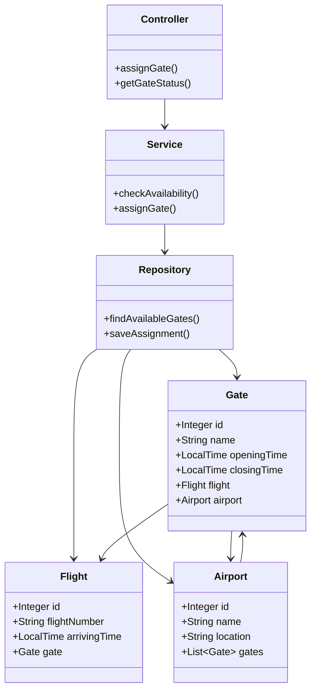

# **Airport Gate Management System**
A Java Spring Boot application for efficient scheduling and allocation of airport 
gates, designed to streamline operations and improve airport resource management.

> **Description of the task:**
>
> Create a REST service that manages available gates for planes to park at an
> airport. The REST service should accept a flight number and return the
> assigned gate. The service appropriate response should be returned from
> the REST service.

> **Technical Requirements**
> - The gates and flights should be managed in a relational database.
> - Any database errors should be handled gracefully.
> - The solution should use spring and hibernate frameworks.
> - It should be thread safe and able to handle multiple concurrent requests.
> - The code should be written so that it is as simple as possible for
    > administrators and other developers to follow and debug any issues.

> Extra Challenge
> - Update the solution so that certain gates are only available between certain
    times. If a request for a gate arrives to the REST service at a specific
    time,
    the service should check what gates are available at the current time as
    well
    as whether they are currently in use.


## 🚀 Tech Stack


---

## ✨ Features
- Manage and assign airport gates
- Register and track flights
- Automatic availability check
- REST API for integration
- Authentication & Authorization with JWT
- API documentation with Swagger
- Unit & integration tests (JUnit, Mockito)
- Dockerized for easy deployment
---

## 📂 Project Structure
- **Controller Layer** – handles REST endpoints
- **Service Layer** – business logic
- **Repository Layer** – database access with Spring Data JPA
- **Entity Layer** – Hibernate ORM mappings
---

## 📦 Package by Feature
- In this project structure, packages contain all classes required for a feature.
- This eliminates cross-package dependencies and keeps classes within a package closely related.
- As a result, packages have **high cohesion**, **low coupling**, and **higher modularity**.

### Advantages of Package by Feature:
- High cohesion, low coupling, and modularity.
- Better encapsulation (more classes can be package-private).
- Reduced navigation across packages.
- Scales better than package-by-layer as the application grows.
- Closer to microservice-style organization.
---

## 🗄️ Database ER Diagram


## 🔄 Sequence Diagram


## 📦 Package Diagram


## 🔒 Security
This application uses Spring Security with JWT (JSON Web Token) authentication 
and role-based access control. 

The main roles are:

ADMIN – has full access to all resources, including creating, updating, 
deleting gates, and managing managers.

MANAGER – can manage gates (create, read, update, delete) and park flights, 
but cannot modify admin-level resources.
---
### Authentication Flow

1. The user registers or logs in using the authentication endpoints.
2. Spring Security generates a JWT token for authenticated users.
3. Every request to a protected endpoint must include the JWT token in the 
Authorization header:
>  Authorization: Bearer <JWT_TOKEN>
4. The token is validated by a Spring Security filter which checks the user’s 
role and permissions.
---
### Roles & Permissions
| Role    | Permissions                                                      |
|---------|------------------------------------------------------------------|
| ADMIN   | admin:update, admin:delete, manager:read, manager:create, manager:update, manager:delete |
| MANAGER | manager:read, manager:create, manager:update, manager:delete     |
| USER    | user:read, user:update                                            |

## ⚙️ Installation and Setup

### ✅ Prerequisites
Make sure you have installed:
- Maven
- Docker
- Docker Compose
---

### 🌀 Clone the Repository
```bash
git clone https://github.com/Maximuss1993/Airport_Gate_Management_System.git
cd Airport_Gate_Management_System
``` 

### 🛠️ Build the Application (with Jib)
```bash
mvn compile jib:dockerBuild
``` 

### 🚀 Run with Docker Compose
```bash
docker compose up
``` 

### 📖 API Documentation

Swagger UI: http://localhost:8181/swagger-ui/index.html

OpenAPI JSON: http://localhost:8181/v3/api-docs


### 🧹 Cleanup
Stop and remove containers, networks, and volumes:
```bash
docker compose down
```